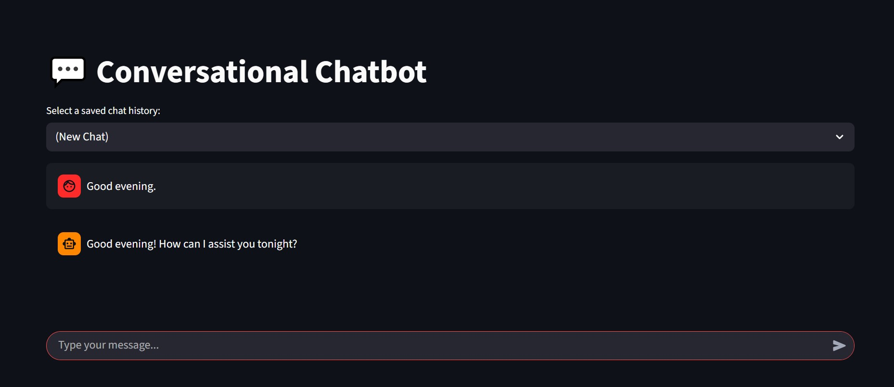
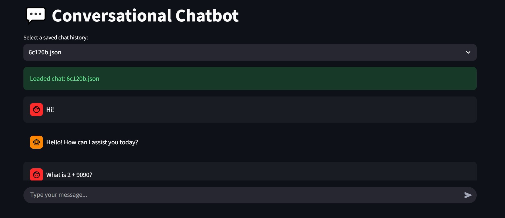

# 💬 Conversational Chatbot

This repository contains code for launching an interface for interacting with an instruction-tuned Large Language Model (LLM). Currently, one can chat with an LLM in two ways:

* Running **Python script** (chatting in the terminal)
* Running a **Streamlit application** in browser (chatting in browser in user-friendly interface)


## 🚀 Chatbot interface

### Preparation of virtual environment

Firstly, one should clone the repository:

```bash
git clone https://github.com/spolivin/conv-chatbot

cd conv-chatbot
```

Secondly, create a python virtual environment to install the dependencies or use conda for simplicity like so:

```bash
conda create -y -n chat-venv python=3.10
conda activate chat-venv
pip install -r requirements.txt
```

or just via using an already prepared conda script:

```bash
source setup_env.sh
```
> Note: In case of using Linux.

### Launching chatbot

#### Python script

We can run the chatbot as a script and after model loading a user will be prompted to send a message:

```bash
python run_chatbot.py
```
> Enter `quit` to exit the chatbot.

Alternatively, we can load a conversation one have started and exited by running the following command:

```bash
python run_chatbot.py --chat-id=6c120b
```
> Chat ID is found by JSON file name from [chats](./chats/) folder. All saved user-assistant messages will appear in the terminal window.

Currently the script uses `Qwen/Qwen2.5-1.5B-Instruct` model from Hugging Face. The model has been chosen due to its relatively small size and due to the absence of GPU on a local machine. Despite these limitations, the script is adapted to efficiently run the model on both CPU and GPU.

For instance, an excerpt from the possible conversation:

```
You: Hello!
Assistant: Hello! How can I assist you today?

You: What is meant by a proton? 
Assistant: A proton is a subatomic particle that has a positive electric charge, with an atomic number of 1 and mass equal to approximately 1.6726 × 10^-27 kilograms.

Protons are found in the nucleus of every atom and play a crucial role in determining the chemical properties of elements. They combine with neutrons and electrons to form atoms and molecules. Protons have an important effect on the stability of the nucleus and contribute to the overall structure of the atom.
```
> Examples of conversations as they are saved in JSON format can also be seen in [this directory](./chats/).

#### Streamlit app

Chatbot can be run in a much more user-friendly manner via Streamlit:

```bash
streamlit run chatbot_ui.py
```
> Running the command will open a browser window, load the model and will ask to load a saved chat or start a new one. To close the app enter Ctrl+C in the terminal window.

User interface in its current version looks like this:



You can choose either a new chat or load an existing chat from JSON files saved in [chats](./chats/) folder. When loading the saved chat, messages are automatically appearing in the current window:



## ✨ Design details

Responses from the user and assistant are saved and appended to chat history after each turn, thus enabling the LLM to remember what has been said previously and keeping the conversation going. Furthermore, using chat templates helps the model to adequately generate its responses in ChatGPT-like fashion.

Futhermore, recently added feature enables loading and saving chats with the assistant that have been started before. For instance, running the Python script to launch the chatbot will on exit save a conversation in `chats` folder in the current working directory. 
